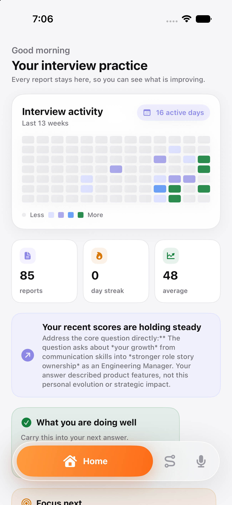
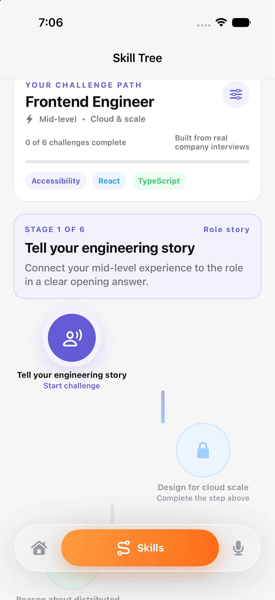
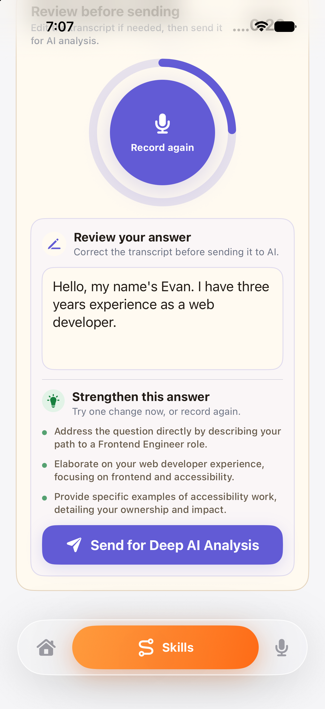
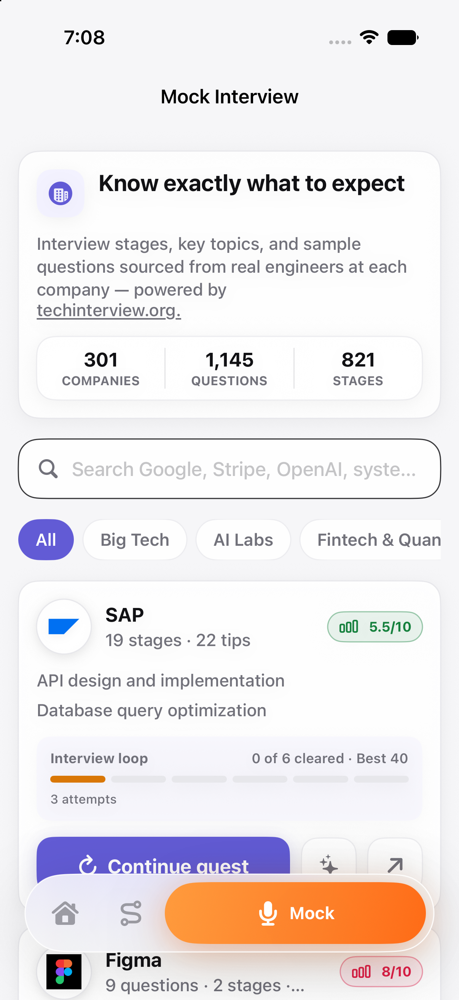
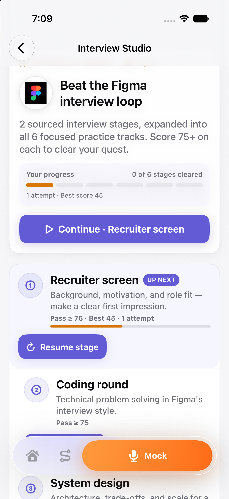

<div align="center">

# CareerVivid iOS

### Turn real interview practice into a daily, visible path to a stronger next role.

[Open Vivid](https://careervivid.app) · [Read the iOS experience guide](docs/ios-mobile-experience.md)

</div>

<div align="center">
  
</div>

CareerVivid iOS is the mobile interview-practice companion to [CareerVivid](https://careervivid.app). It turns company interview guides, a candidate's target role, spoken responses, and AI feedback into a small repeatable loop: choose a direction, answer one focused question, improve the transcript, review the report, and take the next challenge.

## Test account (for reviewers)

Sign in with this shared demo account to explore the full experience — no setup required:

- **Email:** `evan@careervivid.app`
- **Password:** `123456`

## The candidate loop

1. **Choose a target.** Build a Skill Tree from a role, experience level, current strengths, and a growth direction.
2. **Practice a real interview theme.** Start a personalized challenge or a company-specific interview stage.
3. **Speak, review, and improve.** Record a timed answer, edit the transcript, and use concise improvement hints before sending it.
4. **Learn from every attempt.** Deep AI Analysis produces an interview report; each attempt stays in history, including retries on the same question.
5. **Return tomorrow.** Home surfaces activity, score trends, strengths, and one focused next action.

## Product surfaces

### Home: progress that explains itself

The Home tab is report-first rather than a generic dashboard. A GitHub-style activity map makes consistency visible, while the most useful strength and next improvement stay one tap away. Every saved attempt remains available from report history, including retries on the same question.

### Skill Tree: role-aware practice, not a generic course

Candidates select a role family, exact target role, experience level, current skills, and growth direction. The app preselects role-relevant skills — for example, Swift / SwiftUI and API Design for an iOS engineer — but keeps every choice editable. It then converts the profile into six progressive challenges grounded in real company interview themes.

<div align="center">
  
</div>

### Voice-first practice with an editable review step

The candidate taps once to record and again to finish. CareerVivid turns the captured answer into an editable transcript, provides direct suggestions to strengthen it, then sends the reviewed response for deep analysis. The intermediate review step gives users control over recognition errors and makes the AI handoff explicit.

<div align="center">
  
</div>

### Company Quests

Mock Interview provides an explorable catalog of company guides. Each company quest expands sourced stages into a consistent six-stage practice loop: recruiter screen, coding, system design, behavioral, values, and final round. Coding and system-design stages can open their specialized web workspaces; spoken stages remain native to iOS.

<div align="center">
  
</div>

<div align="center">
  
</div>

## How the iOS app is put together

| Area | Implementation |
| --- | --- |
| App UI | SwiftUI, iOS 17+ |
| Navigation | Home, Skill Tree, and Mock Interview in a persistent floating tab bar |
| Role personalization | Local `InterviewSkillProfile` and role-to-skill defaults, with an editable catalog of role families and skills |
| Company interview catalog | Mobile guide catalog backed by CareerVivid company-guide metadata and the same authenticated question endpoint used for web/mobile parity |
| Spoken answer capture | `AVAudioEngine` / AVFoundation, optional Apple native speech recognition for live draft text, and WAV capture |
| Transcript service | `mobileInterviewTranscribe` Cloud Function in `us-west1`; returns editable transcription and up to three suggestions |
| Deep analysis | `mobileInterviewAnalyze` Cloud Function evaluates the exact question, company, stage, transcript, and response duration |
| History and progress | On-device report cache and quest/Skill Tree progress, with authenticated remote report loading when available |

```text
target role + selected skills
        ↓
Skill Tree or Company Quest
        ↓
exact question from the official mobile question endpoint
        ↓
record → transcribe → edit + strengthen → Deep AI Analysis
        ↓
saved report → Home insights → next focused challenge
```

## Repository guide

| Path | Purpose |
| --- | --- |
| [App/](App/) | App entry point and iOS launch configuration |
| [Sources/](Sources/) | Swift source code of the Vivid app |
| [Tests/](Tests/) | Swift test target files |
| [project.yml](project.yml) | XcodeGen specification file |
| [docs/ios-mobile-experience.md](docs/ios-mobile-experience.md) | Complete annotated iOS product walkthrough |
| [docs/screenshots/ios/](docs/screenshots/ios/) | Screen evidence used by this README and the experience guide |

## Run Vivid locally

```bash
git clone https://github.com/JiawenZhu/careervivid-ios.git
cd careervivid-ios
xcodegen generate
open CareerVividMobileMVP.xcodeproj
```

In Xcode, select the `CareerVividMobileMVP` scheme and an iPhone simulator. The project targets iOS 17.0 and later.

To validate from Terminal with a full Xcode installation selected:

```bash
xcodebuild -project CareerVividMobileMVP.xcodeproj \
  -scheme CareerVividMobileMVP \
  -destination 'platform=iOS Simulator,name=iPhone 17 Pro' build
swift test
```

For the complete product journey and every supplied screen, see the [iOS experience guide](docs/ios-mobile-experience.md).
