# CareerVivid iOS product walkthrough

CareerVivid iOS turns interview preparation into a daily practice loop. The product has three connected surfaces: **Home** for evidence of improvement, **Skill Tree** for a personalized challenge path, and **Mock Interview** for company-specific practice.

This guide documents the current mobile experience with the supplied iPhone 17 Pro screens.

## 1. Home makes every attempt useful

Home starts with practice history, not empty productivity metrics. The activity grid makes consistency legible over thirteen weeks; the summary cards show report count, current streak, and average score. The coaching cards reduce a report to one strength to carry forward and one concrete improvement to make next.

Every report stays available independently. A new attempt on the same question becomes a new result, so candidates can compare progress rather than lose prior evidence.

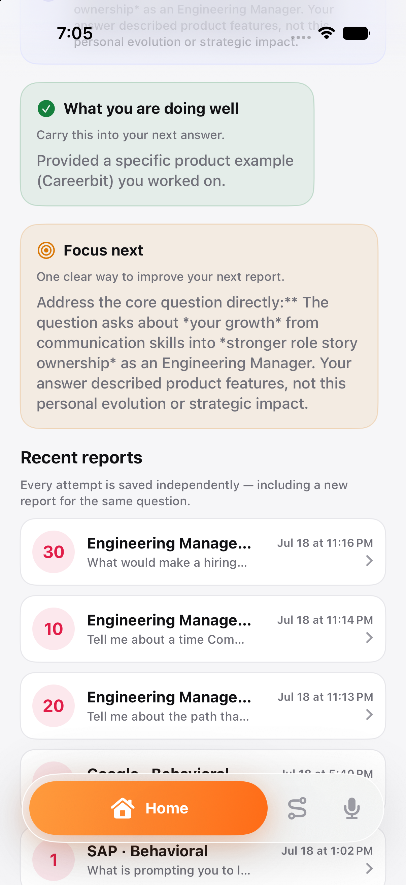

## 2. Skill Tree starts with the candidate, not a preset curriculum

The Skill Tree begins with a short, editable profile. A candidate selects a career family, then a specific target role and experience level. The setup covers engineering, product, design, data and AI, people, and customer-growth paths rather than assuming every candidate is a software engineer.

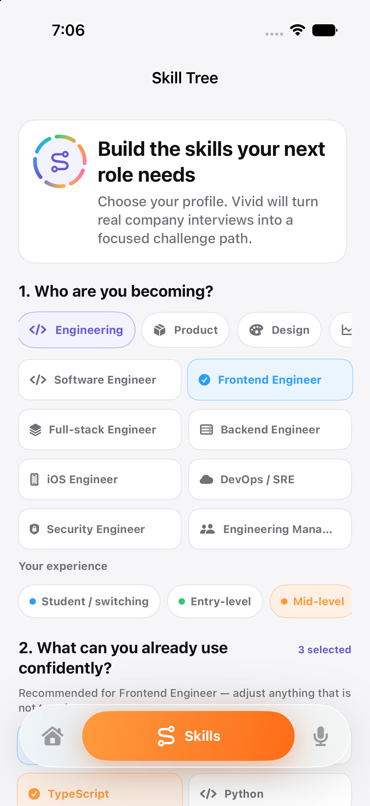

Role selection changes the recommended starting skills. The candidate can choose from a broad skill catalog and set a growth goal; the distinct chip colors make selections fast to scan without implying that one skill family is always better.

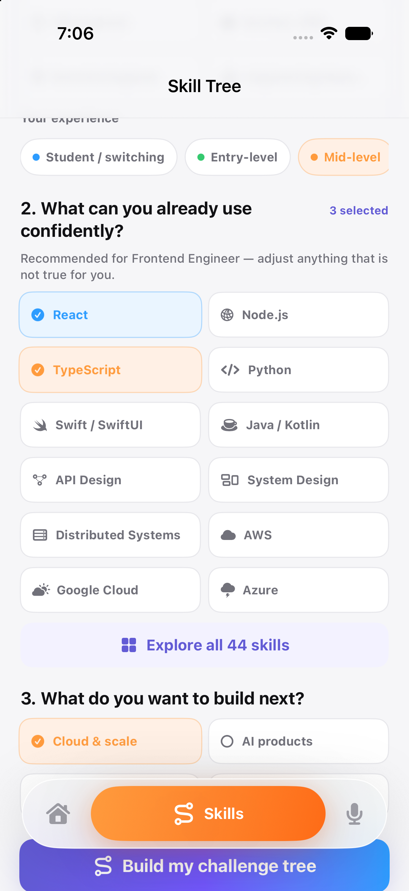

## 3. The profile becomes a challenge path

The generated path states the role, level, goal, relevant skill tags, completed count, and its source: real company interview themes. The first step is actionable while later nodes are intentionally locked until the previous challenge is completed.

The visual path uses alternating nodes, soft color families, and connecting routes to make progression feel game-like while keeping the next required step unambiguous.

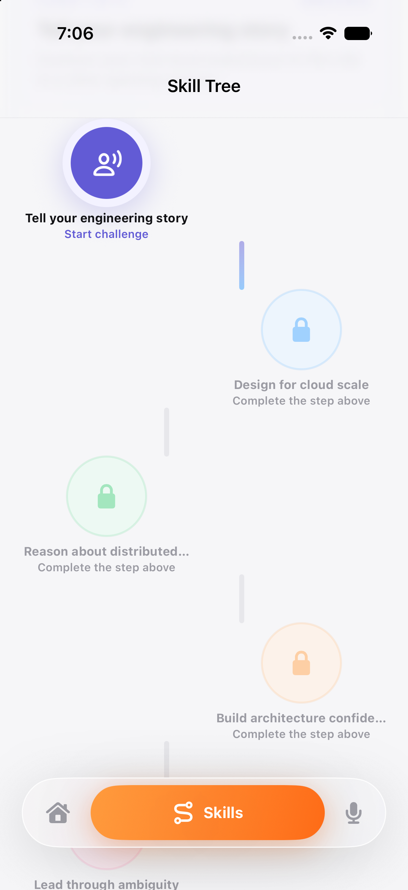

## 4. Personalized challenges still use a disciplined interview format

Skill Tree challenges create a role-and-skill-specific behavioral question. The question names the target role and the skill theme, then gives concise structure guidance. A source label explains when the prompt is personalized from a company interview theme instead of being a direct company-stage question.

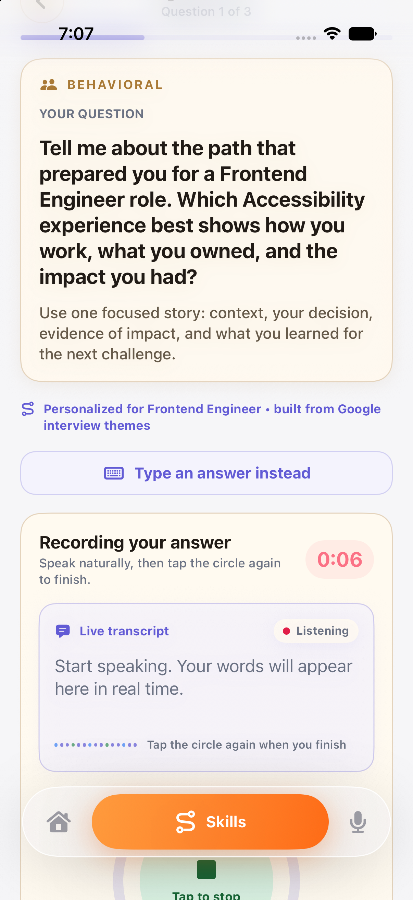

Candidates can also type an answer. Native spoken challenges use a timed circular recorder: tap once to start and again to stop.

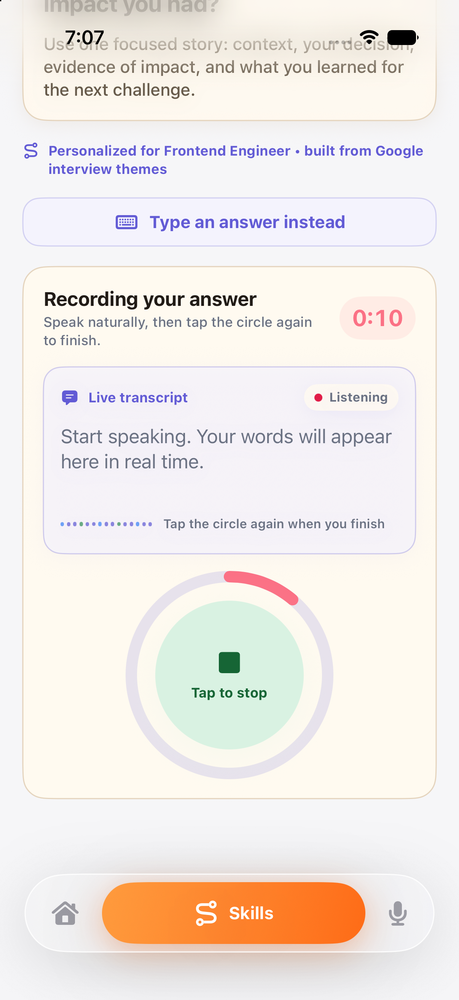

The next question retains the same personalized provenance and makes the remaining time obvious before recording begins.

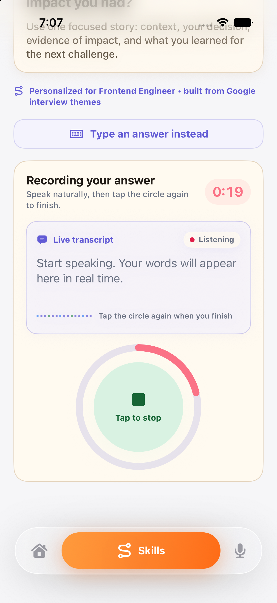

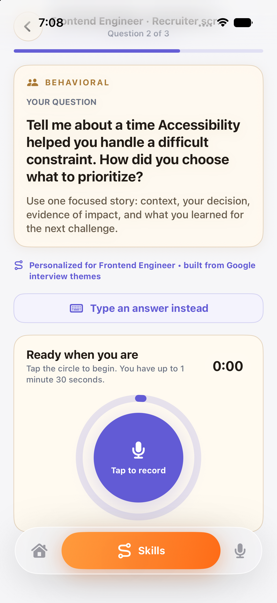

## 5. Record, transcribe, review, then analyze

When recording ends, the UI moves into a dedicated transcription state rather than showing an ambiguous loading spinner. It keeps the answer duration, explains the handoff, and uses an animated multi-color progress ring around the transcription state.

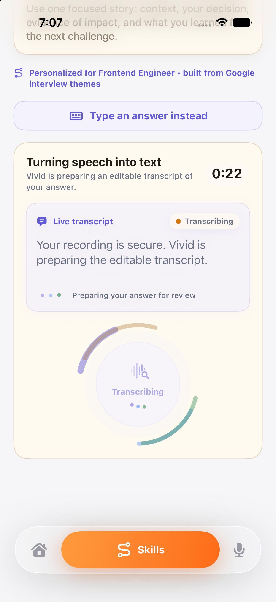

The transcript is editable before it is sent. Vivid also provides short, practical suggestions that the candidate can apply immediately or use as a reason to record again. The user explicitly sends the reviewed answer with **Send for Deep AI Analysis**.

## 6. The report evaluates the exact answer

The resulting interview report breaks down communication, confidence, and answer relevance — described as the connection to the specific question. It retains the original question so candidates can relate each score and recommendation to the answer they actually gave.

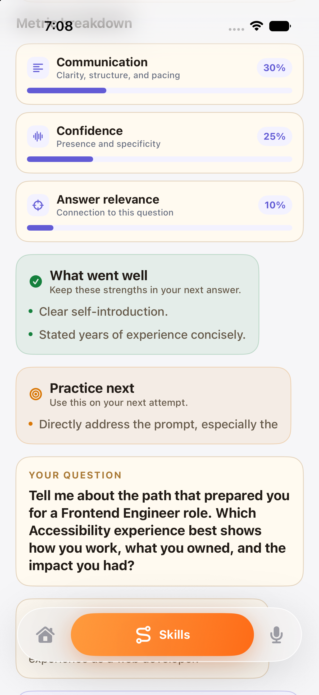

## 7. Mock Interview makes company data approachable

Mock Interview is the catalog for the company-guide experience. It exposes sourced interview-stage counts, company search, filters, real-company topic previews, difficulty, and each candidate's quest progress.

Companies make progress easy to understand: a visible interview-loop meter, attempt count, best score, and a direct Continue quest action. Users can compare active and not-started companies in the same scroll.

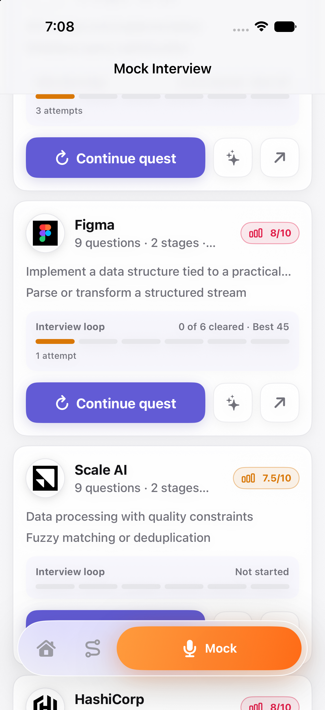

## 8. Company Quests normalize the real interview loop

Some source guides have only one or two reported stages. CareerVivid expands them into a consistent six-stage preparation loop, keeping the result predictable for candidates: recruiter screen, coding, system design, behavioral, values, and final round.

Coding and system-design stages lead to the dedicated web coding or whiteboard experiences. Recruiter, behavioral, values, and final rounds remain in the native speech-and-report loop.

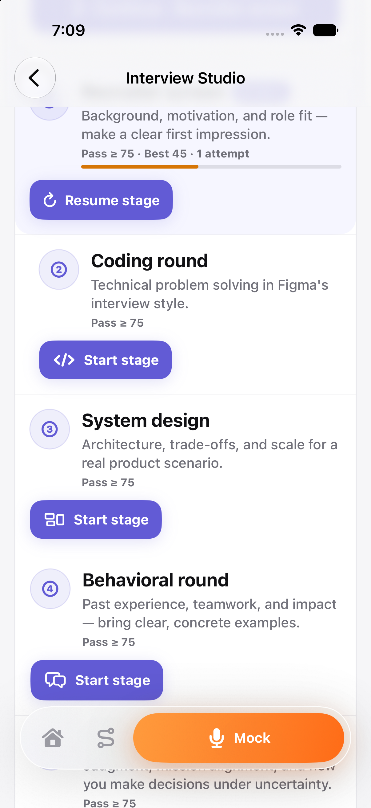

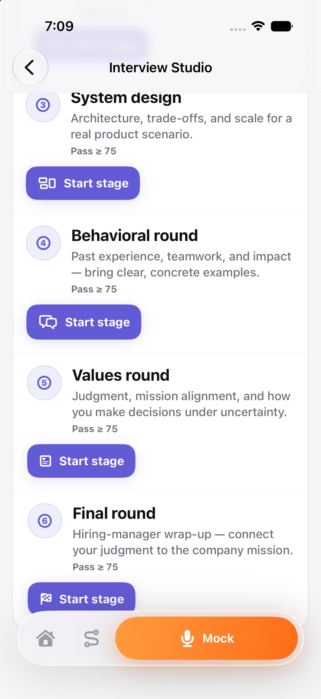

## Data and service contract

| Step | Source of truth | Result |
| --- | --- | --- |
| Company question selection | Authenticated `mobileInterviewQuestions` Cloud Function | Exact guide-and-stage questions shared with CareerVivid's mobile/web question flow |
| Native audio practice | AVFoundation WAV capture; Apple speech recognition when available | Timed recording and optional live draft |
| Transcript review | `mobileInterviewTranscribe` Cloud Function in `us-west1` | Editable transcript and up to three user-facing suggestions |
| Deep feedback | `mobileInterviewAnalyze` Cloud Function in `us-west1` | Score, metric breakdown, strengths, practice-next guidance, and transcript context |
| Long-term progress | Device report cache and quest/Skill Tree progress, plus authenticated remote report history when available | New attempts remain visible instead of replacing prior reports |

## Design principles

- **One repeatable loop.** Each screen leads to the next useful action instead of exposing every possible career task.
- **Personalization with provenance.** Skill Tree prompts explain their role and source context; company-stage prompts preserve the official source guide.
- **User control before AI evaluation.** Candidates can edit recognition output before sending it for analysis.
- **Progress is evidence, not decoration.** Scores, activity, cleared stages, locked nodes, and saved reports all correspond to persisted practice work.
- **Warm, accessible feedback.** Soft lavender, blue, green, peach, and orange states differentiate actions without relying on severe error red for normal practice.
